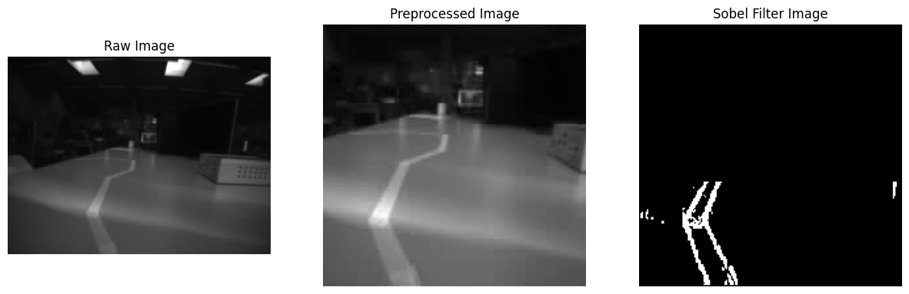
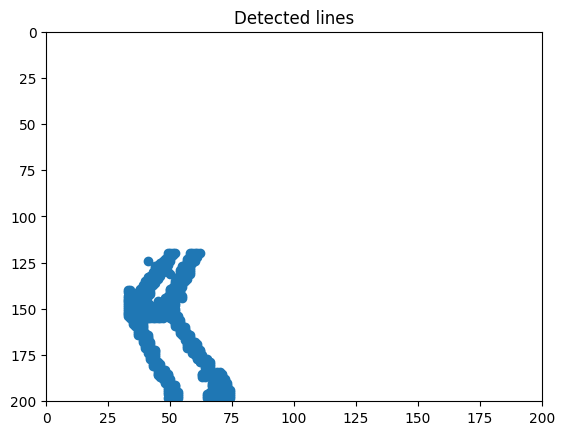
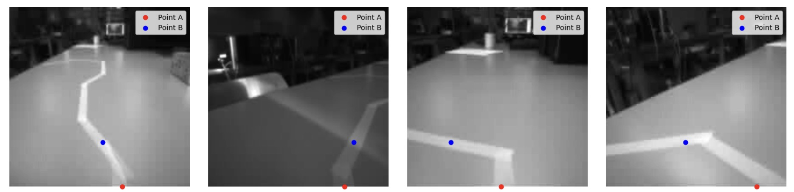

# Artificial Intelligence for Autonomous Systems

## Lab 2 - Following a line

**Auteurs :** Cédric Rosat, Costantino Cecchet

**Date :** 15.04.2024

## Objectifs

Dans ce laboratoire, l'objectif est d'implémenter un algorithme permettant de suivre une ligne sur une image provenant du drone CrazyFlie. Pour ce faire, l'algorithme reçoit en entrée une image de 200x200 pixels en nucances de gris (1 channel) et doit placer deux points sur cette dernière. Le premier (point A) se situe tout en bas de l'image (proche du drone) et le second (point B) un peu haut dans l'image (plus loin du drone). Nous détaillerons plus loin la distance que nous avons choisit pour placer ce second point.

## Approche

### Réseaux de neurones

Dans un premier temps, nous avions pensé utiliser un réseau de neurones pour implémenter notre solution. Cependant, nous nous sommes rapidement rendu compte de la difficulté d'une telle solution. En effet, si nous souhaitons entrainer notre réseau, nous avons besoin de plusieurs centaines d'images qui doivent être suffisamment variées pour que le réseau puisse généraliser la détection de ligne. Hors, nous avons moins de 30 images provenant du drone pour l'entraînement.

Une solution à cela serait de générer des images synthétiques afin de compléter notre jeu d'entraînement. Cependant, et comme mentionné plus haut, nous devons générer des images suffisamment variées et réalistes afin que notre réseau puisse en apprendre quelque chose. Cela rend la génération d'images assez fastidieuse. Nous avons décidé d'abandonner cette solution et d'utiliser des algorithmes de machine learning qui ne nécessitent pas de données d'entraînement.

### Apprentissage non-supervisé

Notre idée est la suivante. Si nous arrivons à isoler la ligne sur notre image, nous pouvons utiliser un algorithme non-supervisé afin de détecter la forme de la ligne, puis d'y placer nos points.

La première étape consiste à isoler notre ligne de notre image. Pour ce faire, nous allons appliquer un filtre de Sobel sur notre image. Comme nos lignes sont le plus souvent verticales, nous avons donné plus d'importance au kernel détectant les contours verticaux. Ensuite, nous avons appliqué seuil afin de rendre les pixels dont le gradient d'intensité est faible noir et les autres blancs. Cela nous permet d'avoir une image binarisée. Pour finir, nous avons rendu noir tous les pixels qui se situent trop loin du drone car ces derniers ne sont pas pertinents pour le placement de notre second point. Voici un exemple :

De gauche à droite, nous avons une image brute provenant du drone, puis cette même image réduite à 200x200 pixels ainsi que convertie en nuances de gris (l'image provenant du drone possède 3 channels et nous avons réduit les channels à 1) et pour finir, nous avons la sortie de notre filtre de Sobel.

Maintenant que notre ligne est isolée, nous voyons qu'il y a encore un peu de bruit qui est passé au travers du filtre. Nous allons maintenant utiliser un algorithme d'apprentissage non-supervisé DBSCAN. Ce dernier créé des groupes en se basant sur la densité des points et le nombre de points par groupe. Avec cela nous pouvons filter les régions peu denses en pixels blancs ou dont le nombre de pixels serait trop faible. De plus, si plusieurs groupes sont détectés, nous ne gardons que celui qui contient le plus de pixels (La pluspart du temps, le groupe le plus grand est celui de la ligne. Quand ce n'est pas le cas, nous avons des artefacts trop importants présents sur notre image et il nous est impossible de détecter la ligne.). Cela nous donne cette sortie :

Nous pouvons voir que les artefacts présents sur la dernière image ont été supprimés. Pour finir, afin de placer nos points A et B, nous prenons quelques pixels tout en bas de l'image (de y=180 à y=195 et non pas 200 car les dernières lignes ont tendance à être bruitées et le placement du point est moins précis) afin de calculer le centre de la ligne en x. Cela nous donne notre point A. Nous faisons la même chose pour calculer le point B en appliquant un offset de 50 pixels. Nous avons prit cette valeur car elle est sufisamment éloignée pour donner une indication sur la direction à suivre sans pour autant être trop éloignée de drone. Voici nos prédictions, les points ne sont pas parfaitement placé, mais l'indication de direction elle reste juste :

Cette technique a aussi ses limites. Nous avons remarqué que les images prises à contre-jour, ou avec trop d'éléments perturbateurs dans l'image ne permettent plus à notre solution de détecter les lignes.

## Conclusion

Pour conclure, ce laboratoire nous a permis de comprendre qu'un réseau de neuronnes est complexe à mettre en place et qu'il faut une quantité assez importante d'images afin d'obtenir un modèle permettant de bien généraliser la détection des lignes. Nous avons donc cherché une autre solution plus simple qui ne nécessite pas de données d'entraînement annotées et qui performe de façon raisonnable. Cette approche est un test et pourrait être améliorée dans le futur.