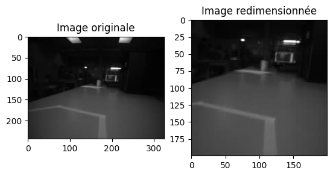
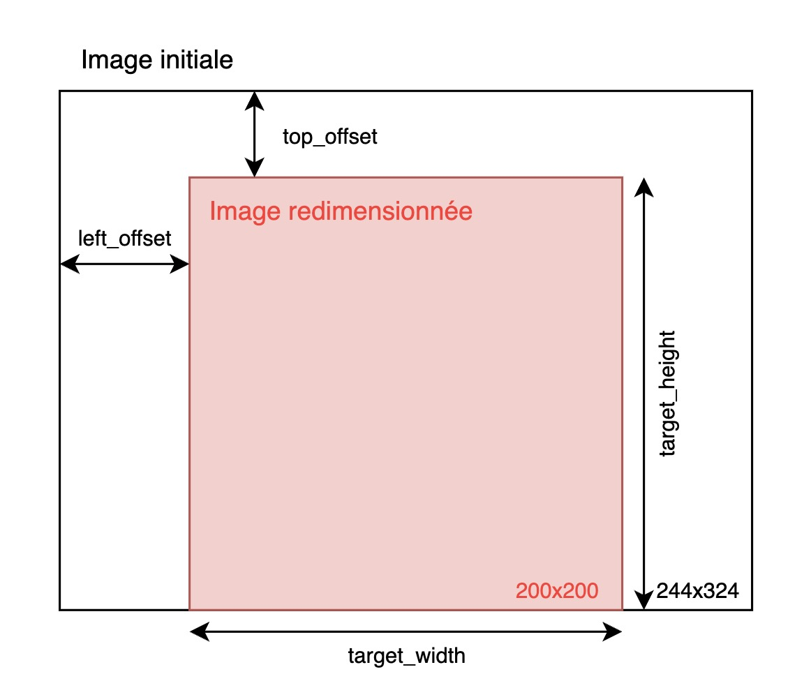

# Rapport labo 3

**Auteurs :** Cédric Rosat, Costantino Cecchet

**Date :** 30.04.2024

## Transfert des informations de l'UART vers STM32

Valeur de la fréquence de la FC : `IAALAB03: CL FREQ = 50000000`. Cette dernière est envoyée depuis le GAP8 et récupérée par le STM32 avant d'être affichée dans la console du client Crazyflie.

## Création d'une tâche WiFi

Voici un exemple d'affichage dans la console du client Crazyflie lorsqu'on se connecte au drone :

```
CPX: ESP32: I (7374) WIFI: station:60:3e:5f:35:aa:4e join, AID=1 <= Indique qu'un client s'est simplement connecté au WiFi 
CPX: ESP32: I (11624) WIFI: Connection accepted <= Le client a ouvert un socket (p. ex avec le script connect.py)
CPX: ESP32: I (11634) WIFI: Client connected <= Message venant de l'ESP32 indiquant que la connection est établie
CPX: CPX connected <= La librairie CPX indique que la connection est établie
CPX: GAP8: Wifi client connection status: 1 <= Notre print qui indique que le client a ouvert un socket
CPX: GAP8: Client connected...CPX: GAP8:  starting capture.
CPX: GAP8: Stop image capture
CPX: GAP8: Send image of size: 200x200
CPX: ESP32: I (11934) WIFI: Client disconnected <= L'ESP32 indique que le socket a été fermé par le client
CPX: CPX disconnected <= Même message de la part de la librairie CPX
CPX: ESP32: I (11934) WIFI: Waiting for connection <= L'ESP32 est prêt pour ouvrir un nouveau socket
CPX: GAP8: Wifi client connection status: 0 <= Notre print indiquant que le socket a été fermé
```

Les messages de l'ESP32 et de la librairie CPX sont gérés par la `xTask` `rx_wifi_task` qui créé un "listener" permettant d'accepter et de gérer des connections wifi. Quand on ouvre/ferme un socket, dans notre `rx_wifi_task` on reçoit un paquet `rxp` qu'on peut lire afin de définir si le client a ouvert/fermé le socket.

Lorsqu'un premier client se connecte au WiFi du drone, sa connection est acceptée et il peut ensuite ouvrir un socket. Si maintenant un second client tente de se connecter pendant que le premier est encore connecté, la connection ne peut se faire. Cependant, on ne voit pas dans notre console qu'une seconde connection a été refusée. Le client affiche simplement un message pour dire que le WiFi est inaccesible sans autres informations. Ce comportement est bizarre sachant que, selon le datasheet du module EPS32 NINA W102, ce dernier prend en charge le WiFi 802.11b/g/n qui devrait accepter jusqu'à 200 connections en simultané.

## Acquisition de l'image


## Transfert des informations du GAP8 vers le PC via WiFi


## Traitement des images

### Exemple

Sur les images ci-dessous, on peut voir à droite, l'image originale provenant du drone (244x324) et à gauche, l'image redimensionnée (200x200).



### Explication de l'algorithme



Dans la figure ci-dessus, on peut voir l'image originale et l'image redimensionnée. Nous avons décidé de centrer cette dernière sur son axe horizontal mais de la placer au plus bas sur son axe vertical. Cela nous permet de garder les informations visuelles qui se situes au plus proche du drone (voir image dans la partie exemple).